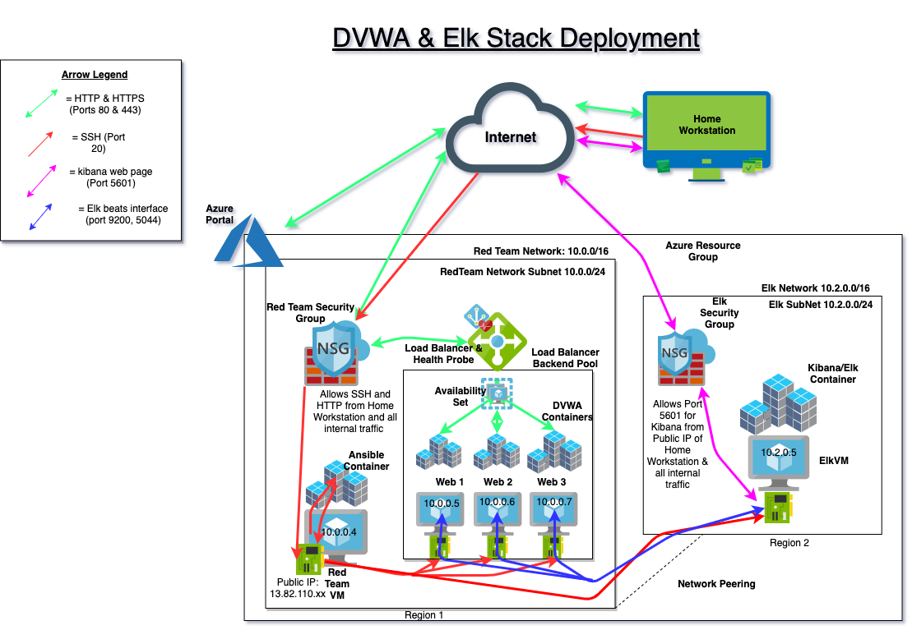

## Automated ELK Stack Deployment

The files in this repository were used to configure the network depicted below using an instance of ansible deployed from a docker image.



These files have been tested and used to generate 3 instances of the "Damned Vulnerable Web Application" and a live ELK stack deployment on an Azure cloud Resource group (although it is not limited to that environment the provided documentation will be for setup with Azure). By setting up the network architecture in the Azure portal and running the provided playbooks over SSH you will create the above network. Alternatively, you can install portions of the network on your own system using the provided playbooks individually (assuming your network has a similar topology and you are using ansible). This would allow you to install just the dvwa, or the elk stack and its beats depending on your preference.

  - dvwa playbook: Ansible/dvwaPlaybooks_Ansible/pentest.yml
  - elk playbook: Ansible/elkPlaybooks_Ansible/install-elk.yml
  - filebeat: Ansible/elkPlaybooks_Ansible/filebeat-playbook.yml
  - metricbeat: Ansible/elkPlaybooks_Ansible/metricbeat-playbook.yml

This document contains the following details:
- Description of the Topology
- Access Policies
- ELK Configuration
  - Beats in Use
  - Machines Being Monitored
- How to Use the Ansible Build


### Description of the Topology

The main purpose of this network is to expose a load-balanced and monitored instance of DVWA, the D*mn Vulnerable Web Application, although you can also modify the playbooks to deploy an a docker image of your preference.

Load balancing ensures that the application will be highly available as no one server will be overworked, in addition to restricting access to the network based on IP.
- _Load Balancers protect the availablilty of a system, and specifically act as a guard against DDoS attacks. By having multiple instances of a web application in an availability set hooked up to a load balancer we can ensure our organization's material is still available if one or more of the servers are compromised.  The advantage of accessing this from the backend with a jumpbox (RedTeamVM) is that it provides a secure backdoor to the system that only the administrator can access, and in combination with the docker container ensures that noone can ssh into the web server from outside, and even if they can, the assets are secured within the docker container that the intruder would require knowledge of to access (although this is a last ditch defence if the attacker has already gained persistence)_

- !IMPORTANT _while in this example the ssh keys are stored in the .ssh folder of the ansible container THIS IS BAD PRACTICE and is only for simplicity of the demonstration. Store your SSH keys securely in an external repository!_

Integrating an ELK server allows users to easily monitor the vulnerable VMs for changes to the containers and system files, services, & logs.
- _filebeat is a module in elk for forwarding and centralizing log data. It runs as an agent on your servers, monitoring the log files or locations you specify, collects, and forwards them to Elasticsearch or Logstach for indexing_
- _Metricbeat, as the name implies, is used to periodically collect metrics from the operating system and services running on the container/server, and ship them to ELK_


The configuration details of each machine may be found below. Note that while the Loab Balancer is not a VM, it is important to include its details here for the purpose of the exercise.

| Name     | Function | IP Address | Operating System |
|----------|----------|------------|------------------|
|RedTeamVM | Gateway  | 13.82.110.95/10.0.0.4| Ubuntu/Linux     |
| Web-1    | Server   | 10.0.0.5   | Ubuntu/Linux     |
| Web-2    | Server   | 10.0.0.6   | Ubuntu/Linux     |
| Web-3    | Server   | 10.0.0.7   | Ubuntu/Linux     |
| Elk-VM   | Monitor  | 10.2.0.5   | Ubuntu/Linux     |
|LB        | Balancer |40.114.25.215| N/A              |

### Access Policies

The machines on the internal network are not exposed to the public Internet. 

Only the Jump box machine (RedTeamVM) can accept connections from the Internet. Access to this machine is only allowed from the following IP addresses:
- _(Home Workstation IP address)_
- _(someone you trust's IP address)_

Machines within the network can only be accessed by the jumpbox, RedTeamVM. The _JumpBox_ is also able to ssh to _ElkVM_ on the adjacent _ElkNet_ network thanks to adding the _network peering_. This is treated as internal traffic allowed by our secuirty rules, so the jumpbox is still the only way to ssh to the network. 

A summary of the access policies in place can be found in the table below.

| Name     | Publicly Accessible | Allowed IP Addresses |
|----------|---------------------|----------------------|
| RedTeamVM| Yes                 | (#mypublicIP)port 22 |
| Web 1    | no                  | RedTeamNet, ElkNet   |
| Web 2    | no                  | RedTeamNet, ElkNet   |
| Web 3    | no                  | RedteamNet, ElkNet   |
| Elk VM   | Yes port 5601 no port 22                | ElkNet, RedteamNet, # mypublicIP port 5601   |
| LB       | yes                 | #mypublicIP port 80  |

### Elk Configuration

Ansible was used to automate configuration of the ELK machine. No configuration was performed manually, which is advantageous because it can save a lot of time and resources to automate the configurationg and deployment of webservers. Furthermore, running ansible playbooks is non-destructive, which makes the process much easier to troubleshoot as it reduces the amount of backtracking.

#### The pentest.yml playbook implements the following tasks:
- turns off apache 2 (if present)
- installs docker, python 3, and python docker module if not already present
- downloads and launches dvwa in a docker web container running on port 80, ensures it will relaunch on reboot
- enables docker service on boot

#### The install-elk.yml playbook implements the following tasks:

- Installs docker, python 3, and pythong docker module if not already present
- configures the system to use more memory (vm.max_map_count)
- downloads and launches the elk container from docker, reserves ports 5601, 9200, and 5044
- enables docker service on reboot

#### The filebeat-playbook.yml implements the following tasks:

- downloads and installs the debian version of filebeat
- drops in the config file in right directory
- enables, sets up, and starts filebeat service
- enables filebeat service on boot

#### The metricbeat-playbook.yml implements the following tasks:

- downloads and installs the debian version of metricbeat
- drops the metricbeat config file in right directory
- enables, sets up, and starts metricbeat service
- enables metricbeat service on boot


The following screenshot displays the result of running `docker ps` after successfully configuring the ELK instance.


### Target Machines & Beats
This ELK server is configured to monitor the following machines:
- _the webservers: 10.0.0.5, 10.0.0.6, and 10.0.0.7_

We have installed the following Beats on these machines:
- _filebeat and metricbeat_

These Beats allow us to collect the following information from each machine:
- _Filebeat: When you start this beat, it starts one or more inputs that look in the locations you've specified for log data. For each log it finds it starts a harverster process to read for new content and sends that information to ELK_
-_Metricbeat: Metricbeat helps you monitor your server by collecting metrics form the system and other services running on the server. It takes the metrics nad statistics it collects and ships them to ELK_

### Using the Playbook
In order to use the playbook, you will need to have an Ansible control node already configured. Assuming you have such a control node provisioned: 

SSH into the control node and follow the steps below:
- Copy the playbooks, and config files to /etc/ansible.
- Update the hosts file to include webservers group
- 	```
		# /etc/ansible/hosts
		[webservers]
		10.0.0.4 ansible_python_interpreter=/usr/bin/python3
		10.0.0.5 ansible_python_interpreter=/usr/bin/python3
		10.0.0.6 ansible_python_interpreter=/usr/bin/python3

		[elk]
		10.2.0.5 ansible_python_interpreter=/usr/bin/python3
		```
- if neccesary, update the remote_login line in ansible.cfg
- ```
  remote_user = sysadmin
  ```
- ```
   ansible all -m ping
   ``` 
  _tests if ansible is communicating with webservers_
- if neccesary, add the links to the ssh keys in your host file
- Update the filebeat-config file to include...
- ```
  setup.kibana:
    host: "<ELK VM PRIVATE IP>:5601"
    ```
- ```
  output.elasticsearch:
  # Array of hosts to connect to.
  hosts: ["<ELK VM PRIVATE IP>:9200"]
  username: "elastic"
  password: "changeme"

  # Optional protocol and basic auth credentials.
  #protocol: "https"
  #username: "elastic"
  #password: "changeme"
  ```
- 
- 
- Run the desired playbook(s), and navigate to http://<ElkVM Public IP>:5601/app/kibana#/home to check that the installation worked as expected.

_TODO: Answer the following questions to fill in the blanks:_
- _Which file is the playbook? Where do you copy it?_
- _Which file do you update to make Ansible run the playbook on a specific machine? How do I specify which machine to install the ELK server on versus which to install Filebeat on?_
- _Which URL do you navigate to in order to check that the ELK server is running?

_As a **Bonus**, provide the specific commands the user will need to run to download the playbook, update the files, etc._